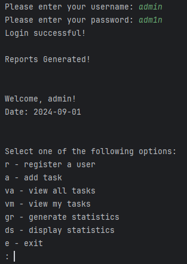
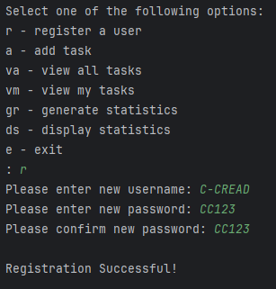
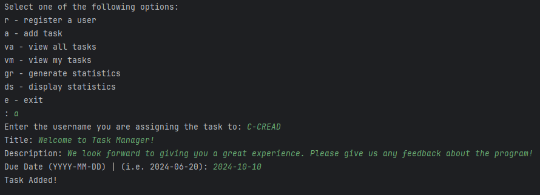
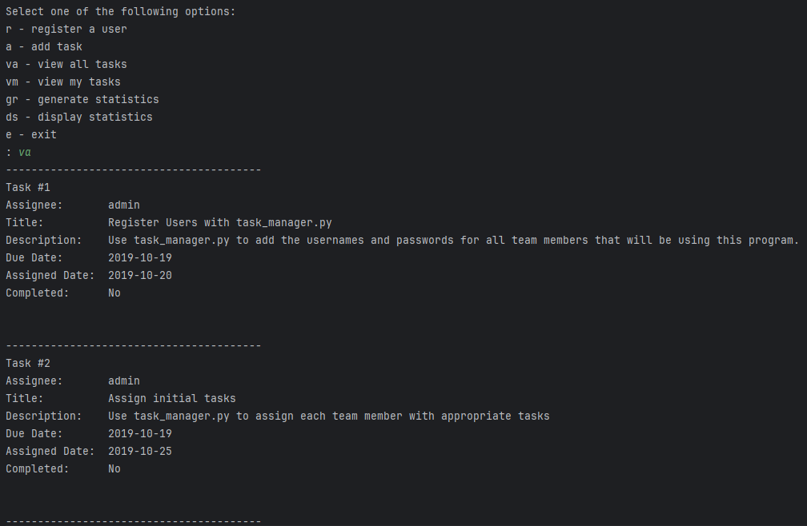
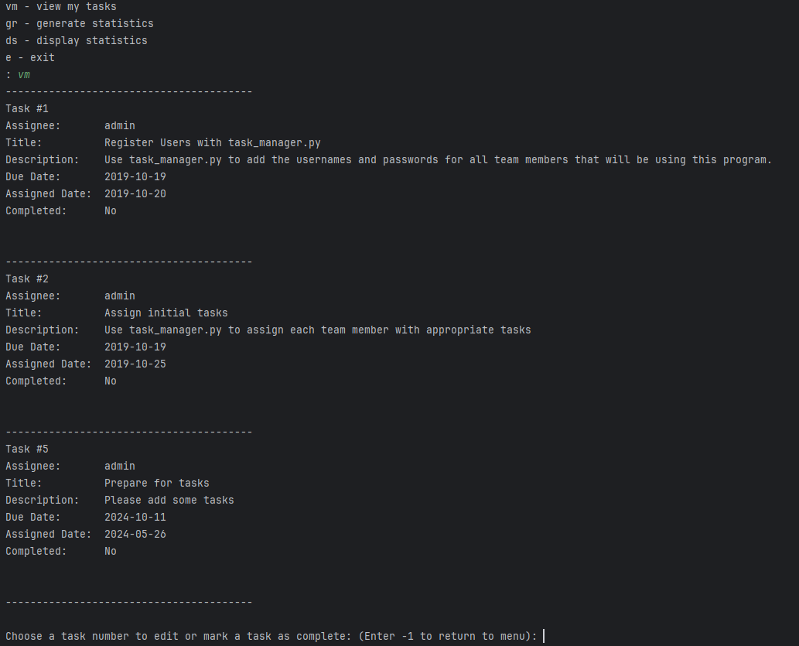
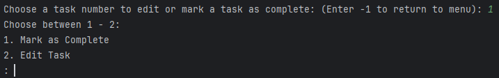
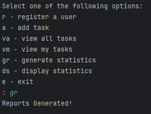
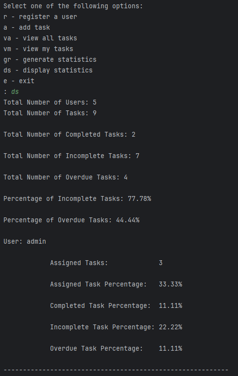

# Task_Manager

## Table of Contents
- [Description](#description)
- [Intallation](#installation)
- [Usage](#usage)
- [Credits](#credits)

## Description
This is a Python Capstone project that will demonstrate my Task Manager simulation. The project will allow the user to log in, create new users and tasks, and generate and display the statistical reports from the text files. 

## Installation
To install this project on your computer, you can run the following commands:
1. Create a directory (folder) where you wish to install the project.
2. Open your terminal/command prompt and navigate to the selected directory
3. In this directory, type the following command:
     ```sh
     git clone https://github.com/C-CREAD/Task_Manager
     ```
4. Navigate to the project folder inside the directory from above:
     ```sh
     cd (folder)
     ```
5. Run the program using the following command:
     ```sh
     python task_manager.py 
     ```

## Usage
The user will be required to login to the project before accessing the menu options. For newcomers, the default admin credentials are:
```sh
Username: admin
Password: adm1n
```

Once you have logged in, you will be greeted with the following message and menu options to choose from:
r - register a user
a - add task
va - view all tasks
vm - view my tasks
gr - generate statistics
ds - display statistics 
e - exit



### Register a User
This option will register new unique users onto the program by entering their username and password.
This option is admin-only and cannot be accessed by non-admin users!



### Add Task
This option will add new tasks for users to complete by a certain due date. 



### View All Tasks
This option displays the task details for all users in the program.



### View All Tasks
This option displays the task details for the user logged in to the program and then requests the user to either mark the task as complete or edit the task by changing the assignee of the user or the due date of the task. 




### Generate Statistics
This option will generate the statistics of all the users and tasks created in the program and store them in new text files 'user_overview.txt' and 'task_overview.txt'.

The statistics include:
- Total number of Users & Tasks.
- Total Numbers of Complete/Incomplete/Overdue Tasks.
- Percentage of Incomplete & Overdue Tasks.
- User statistics on assigned tasks and their completion report.



### Display Statistics
This option will display all of the statistics generated in the program.
This option is admin-only and cannot be accessed by non-admin users!



### Exit
This option will close the program.

## Credits
Shingai Dzinotyiweyi [GitHub Profile](https://github.com/C-CREAD)

[Repository Link:](https://github.com/C-CREAD/Task_Manager) 

